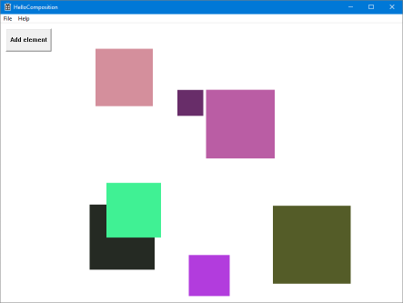
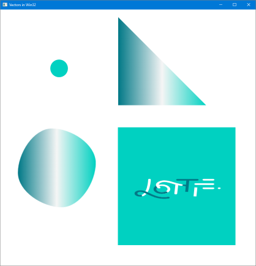
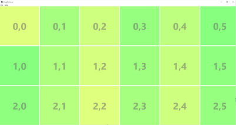
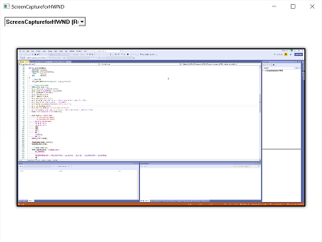
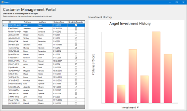
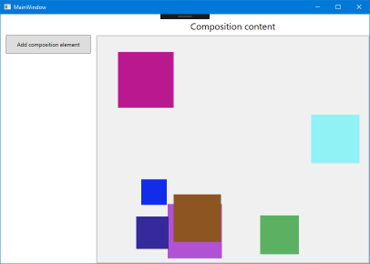
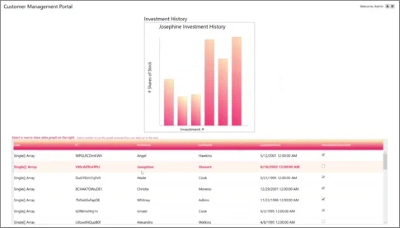
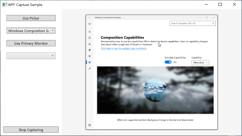

# Visual layer samples for desktop applications

This repository contains samples that demonstrate the use of Window.UI.Composition APIs in WPF, Windows Forms, and C++ Win32 applications.

The Visual layer provides a high performance, retained-mode API for graphics, effects, and animations. It's the foundation for UI across Windows 10 devices. UWP XAML controls are built on the Visual layer, and it enables many aspects of the [Fluent Design System](../design/fluent-design-system/index.md), such as Light, Depth, Motion, Material, and Scale.

You can now use UWP APIs in non-UWP desktop applications to enhance the look, feel, and functionality of your WPF, Windows Forms, and C++ Win32 applications, and take advantage of the latest Windows 10 UI features that are only available via UWP.

## Create a visually engaging user interface in any Windows app

The Visual layer lets you create engaging experiences by using lightweight compositing of custom drawn content (visuals) and applying powerful animations, effects, and manipulations on those objects in your application. The Visual layer doesn't replace any existing UI framework; instead, it's a valuable supplement to those frameworks.

You can use the Visual layer to give your application a unique look and feel, and establish an identity that sets it apart from other applications. It also enables Fluent Design principles, which are designed to make your applications easier to use, drawing more engagement from users. For example, you can use it to create visual cues and animated screen transitions that show relationships among items on the screen.

For related documentation, see [Modernize your desktop app using the Visual layer](https://docs.microsoft.com/windows/uwp/composition/visual-layer-in-desktop-apps)

## Prepare your environment

Minimum requirements for using the Visual layer in desktop apps are listed here. Individual samples might have different requirements, which are listed in the readme for the sample.

- Visual Studio 2017 - [Get a free copy of Visual Studio 2017 with support for building Universal Windows apps](http://go.microsoft.com/fwlink/?LinkID=280676)
- .NET Framework 4.7.2 or later
- Windows 10 version 1803 or later
- Windows 10 SDK 17134 or later

## Samples

### C++ Win32

| Sample |  |
| - | - |
| [**Hello Composition sample**](https://github.com/Microsoft/Windows.UI.Composition-Win32-Samples/tree/master/cpp/HelloComposition) Demonstrates how to set up a project to use Composition APIs in a C++ Win32 app. See the [Using the Visual layer with Win32](https://docs.microsoft.com/windows/uwp/composition/using-the-visual-layer-with-win32) tutorial for more info. |  |
| [**Hello Vectors sample**](https://github.com/Microsoft/Windows.UI.Composition-Win32-Samples/tree/master/cpp/HelloVectors) Demonstrates how to use vectors in the Visual layer. |    |
| [**Virtual Surfaces sample**](https://github.com/Microsoft/Windows.UI.Composition-Win32-Samples/tree/master/cpp/VirtualSurfaces) Demonstrates how to use virtual surfaces in the Visual layer. |   |
| [**Screen Capture sample**](https://github.com/Microsoft/Windows.UI.Composition-Win32-Samples/tree/master/cpp/ScreenCaptureforHWND) Demonstrates how to use screen capture APIs. |   |

### Windows Forms

| Sample |  |
| - | - |
| [**Hello Composition sample**](https://github.com/Microsoft/Windows.UI.Composition-Win32-Samples/tree/master/dotnet/WinForms/HelloComposition) Demonstrates how to set up a project to use Composition APIs in a Windows Forms app. See the [Using the Visual layer with Windows Forms](https://docs.microsoft.com/windows/uwp/composition/using-the-visual-layer-with-windows-forms) tutorial for more info. |  |
| [**Visual Layer Integration sample**](https://github.com/Microsoft/Windows.UI.Composition-Win32-Samples/tree/master/dotnet/WinForms/VisualLayerIntegration) Demonstrates how to use a bar graph created with Composition APIs in a Windows Forms app. |  |

### WPF

| Sample |  |
| - | - |
| [**Hello Composition sample**](https://github.com/Microsoft/Windows.UI.Composition-Win32-Samples/tree/master/dotnet/WPF/HelloComposition) Demonstrates how to set up a project to use Composition APIs in a WPF app. See the [Using the Visual layer with WPF](https://docs.microsoft.com/windows/uwp/composition/using-the-visual-layer-with-wpf) tutorial for more info. |  |
| [**Visual Layer Integration sample**](https://github.com/Microsoft/Windows.UI.Composition-Win32-Samples/tree/master/dotnet/WPF/VisualLayerIntegration) Demonstrates how to use a bar graph created with Composition APIs in a WPF app. |  |
| [**Screen Capture sample**](https://github.com/Microsoft/Windows.UI.Composition-Win32-Samples/tree/master/dotnet/WPF/ScreenCapture) Demonstrates how to use screen capture APIs. |  |

## Limitations

While many Visual Layer features work the same when hosted in a desktop application as they do in a UWP app, some features do have limitations. Here are some of the limitations to be aware of:

- Effect chains rely on [Win2D](http://microsoft.github.io/Win2D/html/Introduction.htm) for the effect descriptions. The [Win2D NuGet package](https://www.nuget.org/packages/Win2D.uwp) is not supported in desktop applications, so you would need to recompile it from the [source code](https://github.com/Microsoft/Win2D).
- To do hit testing, you need to do bounds calculations by walking the visual tree yourself. This is the same as the Visual Layer in UWP, except in this case there's no XAML element you can easily bind to for hit testing.
- The Visual Layer does not have a primitive for rendering text.
- When two different UI technologies are used together, such as WPF and the Visual Layer, they are each responsible for drawing their own pixels on the screen, and they can't share pixels. As a result, Visual Layer content is always rendered on top of other UI content. (This is known as the _airspace_ issue.) You might need to do extra coding and testing to ensure your Visual layer content resizes with the host UI and doesn't occlude other content.
- Content hosted in a desktop application doesn't automatically resize or scale for DPI. Extra steps might required to ensure your content handles DPI changes. (See the platform specific tutorials for more info.)

## Contributing

While we expect to at a later date, this project is not currently accepting contributions. For now, if you have any feedback or questions, please open an Issue on GitHub for the team.

This project has adopted the [Microsoft Open Source Code of Conduct](https://opensource.microsoft.com/codeofconduct/).
For more information see the [Code of Conduct FAQ](https://opensource.microsoft.com/codeofconduct/faq/)
or contact [opencode@microsoft.com](mailto:opencode@microsoft.com) with any additional questions or comments

Copyright &copy; Microsoft Corporation. All rights reserved.
This program/project is and its use is subject to the [MIT License](LICENSE)
