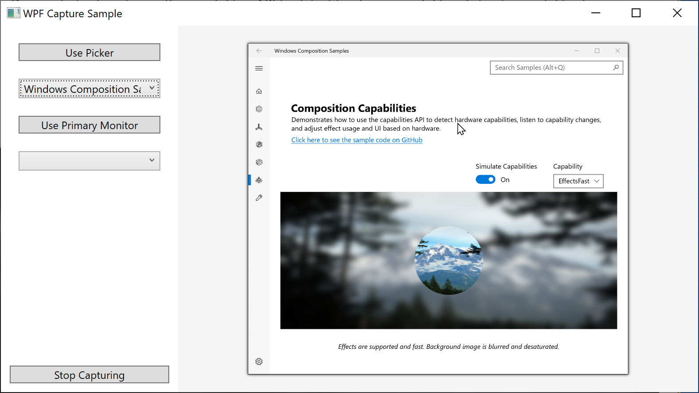

----
## WPF Screen Capture

This sample demonstrates Windows.Graphics.Capture APIs for displays and windows.  This WPF sample also shows how to launch the system picker which can mange enumeration and capture selection for you.

 
 

### Requirements

This sample uses new APIs available in **19H1 insider builds, SDK 18334 or greater**

 - `CreateForWindow` (HWMD) and `CreateForMonitor` (HMON) APIs are in the Windows.Graphics.Capture.Interop.h header

 - Packages for .NET 4.7.2 are required
 - You many need to manually add references for you project.  To do this:  
1. In Solution Explorer, right-click **References**, then select **Add Reference...**.
2. In the **Reference Manager** dialog box, choose the **Browse** button, and then select  **All Files**.

    

3. Add a reference to these files 

  **System.Runtime.WindowsRuntime**
C:\Windows\Microsoft.NET\Framework\v4.0.30319

  **Windows.Foundation.UniversalApiContract.winmd** and **Windows.Foundation.FoundationContract.winmd**
C:\Program Files (x86)\Windows Kits\10\References\10.0.18334.0\…

4. In the **Properties** window, set the **Copy Local** field of each *.winmd* file to **False**.
   For more info about this step, see [Enhance your desktop application for Windows 10](/windows/uwp/porting/desktop-to-uwp-enhance).

### Insiders

[Windows Insider Preview Downloads](https://www.microsoft.com/en-us/software-download/windowsinsiderpreviewSDK)

### More Information

[Windows.Graphics.Capture Namespace](https://docs.microsoft.com/uwp/api/windows.graphics.capture)

----

